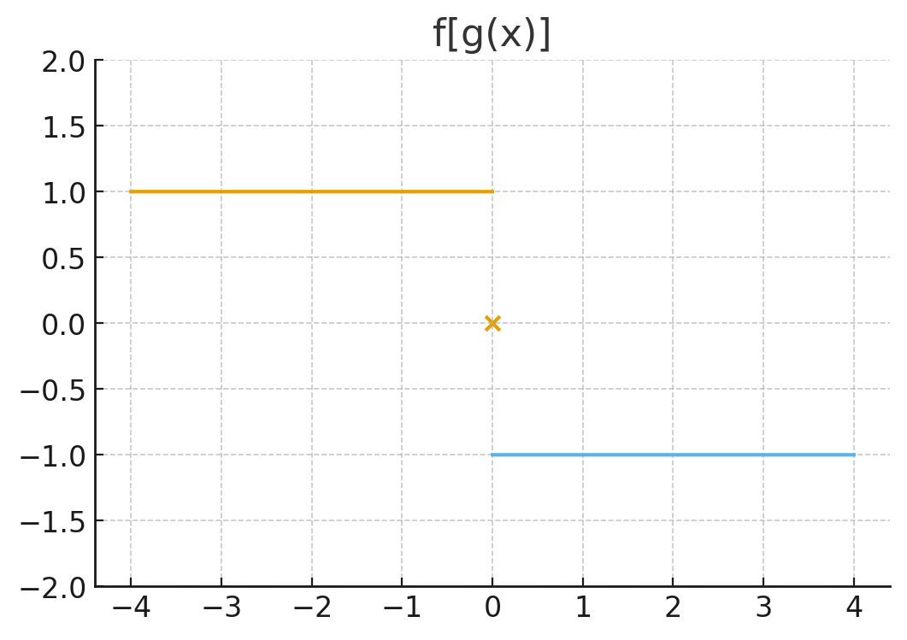

## 一、基础题

### 1.求下列函数值

(1) 设$f(x)=\arcsin x$，求$f(0),f(-1),f\left(\frac{\sqrt3}{2}\right),f\left(-\frac{\sqrt2}{2}\right)$
解答：
$$f(0)=\arcsin 0=0$$
$$f(-1)=\arcsin(-1)=-\frac{\pi}{2}$$
$$f\left(\frac{\sqrt3}{2}\right)=\arcsin\left(\frac{\sqrt3}{2}\right)=\frac{\pi}{3}$$
$$f\left(-\frac{\sqrt2}{2}\right)=\arcsin\left(-\frac{\sqrt2}{2}\right)=-\frac{\pi}{4}$$.

(2) 设
$$f(x)=
\begin{cases}
|\cos x|,\ |x|<\frac{\pi}{3},\\[6pt]
0,\ |x|\ge \frac{\pi}{3},
\end{cases}$$
求$f\left(\frac{\pi}{4}\right),f\left(-\frac{\pi}{6}\right),f(-3)$。
解答：
$$\left|\frac{\pi}{4}\right|<\frac{\pi}{3},\quad f\left(\frac{\pi}{4}\right)=|\cos \frac{\pi}{4}|=\frac{\sqrt2}{2}$$
$$\left|-\frac{\pi}{6}\right|<\frac{\pi}{3},\quad f\left(-\frac{\pi}{6}\right)=|\cos(-\frac{\pi}{6})|=\frac{\sqrt3}{2}$$
$$|-3|> \frac{\pi}{3},\quad f(-3)=0$$.

### 2.下列函数中，哪些是偶函数？哪些是奇函数？哪些既非奇又非偶函数？

(1) $y=x^2(1-x^2)$

解答：
$$f(-x)=(-x)^2(1-(-x)^2)=x^2(1-x^2)=f(x)$$
为偶函数。

(2) $y=\ln\frac{x-1}{x+1}$

解答：
$$f(-x)=\ln\frac{-x-1}{-x+1}=\ln\frac{-(x+1)}{-(x-1)}=\ln\frac{x+1}{x-1}=-f(x)$$
为奇函数。

(3) $y=\frac{1-x^2}{\cos x}$

解答：
分子是偶函数，分母是偶函数，因此整体为偶函数。

(4) $y=\frac{a^x+a^{-x}}{2}$

解答：
$$f(-x)=\frac{a^{-x}+a^{x}}{2}=f(x)$$
为偶函数。

(5) $y=\arcsin x-\cos x+1$

解答：
$\arcsin x$是奇函数，$-\cos x$是偶函数，加常数1破坏对称，因此非奇非偶。

(6)
$$y=
\begin{cases}
-x^2+x,\ x>0,\\[4pt]
x^2-x,\ x<0.
\end{cases}$$

解答：
要验证奇偶性，需要分别计算 $f(-x)$ 与 $\pm f(x)$。
令 $x>0$（只需考虑正的，再用定义）：
原函数在 $x>0$ 时：
$$f(x)=-x^2+x.$$
计算 $f(-x)$：
因为 $-x<0$，应代入第二段：
$$f(-x)=(-x)^2-(-x)=x^2+x.$$
现在比较：
$$f(-x)=x^2+x,\qquad -f(x)= -(-x^2+x)=x^2-x.$$
显然：
$$f(-x)\ne f(x),\qquad f(-x)\ne -f(x).$$
因此该函数 既不是奇函数，也不是偶函数。

### 3.设$f(x)$为定义在$(-a,a)$内的偶函数，且$f(x)$在$(0,a)$内单调递减，证明：$f(x)$在$(-a,0)$内单调递增$(a>0)$。

解答：

任取$-a \lt x_1 \lt x_2 \lt 0$. 因偶函数满足

$$f(x)=f(-x)$$
则
$$f(x_1)=f(-x_1),\quad f(x_2)=f(-x_2)$$
且

$$0 \lt -x_2 \lt -x_1 \lt a$$

而 $f(x)$ 在 $(0,a)$ 上单调递减，故
$$f(-x_2)>f(-x_1).$$
于是
$$f(x_2)=f(-x_2)>f(-x_1)=f(x_1).$$
即 $f(x)$ 在 $(-a,0)$ 上单调递增。

### 4.求下列函数的反函数：

(1) $y=\sqrt[3]{x-1}$

解答：
$$y=\sqrt[3]{x-1}\ \Rightarrow\ x-1=y^3\ \Rightarrow\ x=y^3+1$$
反函数：
$$f^{-1}(x)=x^3+1.$$.

(2) $y=\frac{1-2x}{1+2x}$

解答：
$$y(1+2x)=1-2x$$
$$y+2xy=1-2x$$
$$2x(y+1)=1-y$$
$$x=\frac{1-y}{2(y+1)}$$
反函数：
$$f^{-1}(x)=\dfrac{1-x}{2(x+1)}.$$.

(3) $y=2\sin 3x\quad \left(\frac{\pi}{6}\le x\le\frac{\pi}{6}\right)$

解答：
$$\sin 3x=\frac{y}{2}$$
$$3x=\arcsin\frac{y}{2}$$
$$x=\frac{1}{3}\arcsin\frac{y}{2}$$
反函数：
$$f^{-1}(x)=\frac{1}{3}\arcsin\frac{x}{2}.$$.

(4) $y=\frac{3^x}{1+3^x}$
解答：
$$y(1+3^x)=3^x$$
$$y+y_{3}^x=3^x$$
$$y=3^x(1-y)$$
$$3^x=\frac{y}{1-y}$$
$$x=\log_3\frac{y}{1-y}$$
反函数：
$$f^{-1}(x)=\log_3\dfrac{x}{1-x}.$$.

## 二、提高题

### 5.设

$$f(x)=
\begin{cases}
(x-1)^2,\ x\le 1,\\[4pt]
\frac{1}{1-x},\ x>1,
\end{cases}
\quad
g(x)=
\begin{cases}
2x,\ x>0,\\
3x,\ x\le 0.
\end{cases}$$
求$f[g(x)]$。
解答：
考虑$g(x)$的取值范围：

若$x>0$，则$g(x)=2x>0$，需区分$2x\le1$ 与 $2x>1$。

$$2x\le1\ \Rightarrow\ x\le\frac12,\quad f(g(x))=(2x-1)^2.$$
$$2x>1\ \Rightarrow\ x>\frac12,\quad f(g(x))=\frac{1}{1-2x}.$$

若$x\le0$，则$g(x)=3x\le0\le1$，取第一段：

$$f(g(x))=(3x-1)^2.$$
最终：
\[
f[g(x)] =
\begin{cases}
(3x-1)^2, & x \le 0 \\[4pt]
(2x-1)^2, & 0 < x \le \frac{1}{2} \\[4pt]
\dfrac{1}{1-2x},\ x>\dfrac12.
\end{cases}
\]

### 6.设

$$f(x)=
\begin{cases}
1,\ |x|\lt 1,\\
0,\ |x|=1,\\
-1,\ |x|\gt 1,\\
\end{cases}
\quad g(x)=e^x.$$
求$f[g(x)]$和$g[f(x)]$，并画出两个函数的图形。

解答：
一、求 $f[g(x)]$
先判断 $g(x)=e^x$ 的取值范围：
$$e^x>0,\quad \forall x.$$
因此只需讨论 $e^x$ 与 1 的大小关系。

1. 情况 1：$|g(x)|<1$
即：
$$e^x<1 \quad \Longleftrightarrow\quad x<0.$$
此时：
$$f[g(x)]=1.$$

2. 情况 2：$|g(x)|=1$
即：
$$e^x=1 \quad \Longleftrightarrow\quad x=0.$$
因此：
$$f[g(0)]=0.$$

3. 情况 3：$|g(x)|>1$
即：
$$e^x>1 \quad \Longleftrightarrow\quad x>0.$$
因此：
$$f[g(x)]=-1.$$

结果
\[
f[g(x)] =
\begin{cases}
1, & x < 0 \\[4pt]
0, & x = 0 \\[4pt]
-1, & x > 0
\end{cases}
\]

二、求 $g[f(x)]$
利用：
$$f(x)=
\begin{cases}
1,\ |x|<1,\\
0,\ |x|=1,\\
-1,\ |x|>1,
\end{cases}$$
代入 $g(x)=e^x$ 得：

1. 若 $|x|<1$
$$f(x)=1 \quad\Rightarrow\quad g[f(x)]=e^1=e.$$

2. 若 $|x|=1$
$$f(x)=0 \quad\Rightarrow\quad g[f(x)]=e^0=1.$$

3. 若 $|x|>1$
$$f(x)=-1 \quad\Rightarrow\quad g[f(x)]=e^{-1}=\frac{1}{e}.$$

结果
\[
g[f(x)] =
\begin{cases}
e, & |x| < 1 \\[4pt]
1, & |x| = 1 \\[4pt]
\dfrac{1}{e}, & |x| > 1
\end{cases}
\]

三、图形
1. $f[g(x)]$ 的图形

这是一个三段常值函数：

当 $x<0$ 时，函数值为 1（水平线段）

当 $x=0$ 时，函数值为 0（单独的点）

当 $x>0$ 时，函数值为 -1（水平线段）

图形形状：三段水平直线，中间“跳变”，在 $x=0$ 处为 0 点。

2. $g[f(x)]$ 的图形

分三段水平线：

区间 $(-1,1)$ 上恒为 $e$

点 $x=\pm 1$ 时取值为 1

区间 $(-\infty,-1)\cup(1,\infty)$ 上恒为 $1/e$

图形为三段水平线，中间高，两边低，在 $x=\pm1$ 处为单独的点。

## 三、考研真题

### 7.（19900306）设函数$f(x)=xe^{\sin x}\tan x$，则$f(x)$是（　）。

A. 偶函数
B. 无界函数
C. 周期函数
D. 单调函数

解答：

分别判断：
$$f(-x)=(-x)e^{\sin(-x)}\tan(-x)=(-x)e^{-\sin x}(-\tan x)=xe^{-\sin x}\tan x\neq\pm f(x),$$
故不是奇偶函数，排除A。
当$x\to \frac{\pi}{2}^-$，$\tan x\to +\infty$，且$xe^{\sin x}>0$，故
$$f(x)\to +\infty,$$
为无界函数，应选B。
该函数包含$x$，不是周期函数，排除C。
同时在不同区间符号改变与震荡，不可能是单调函数，排除D。
正确答案：B
